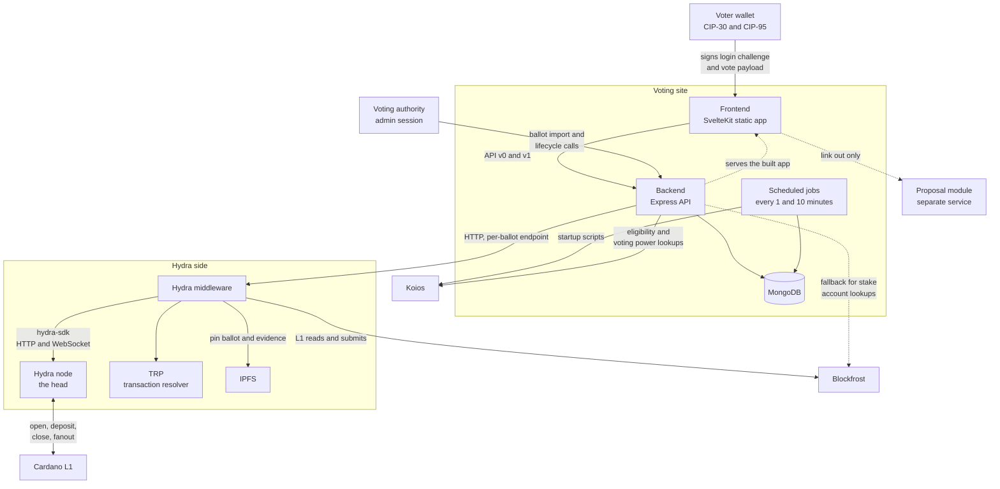
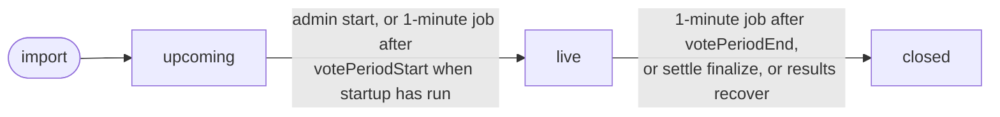
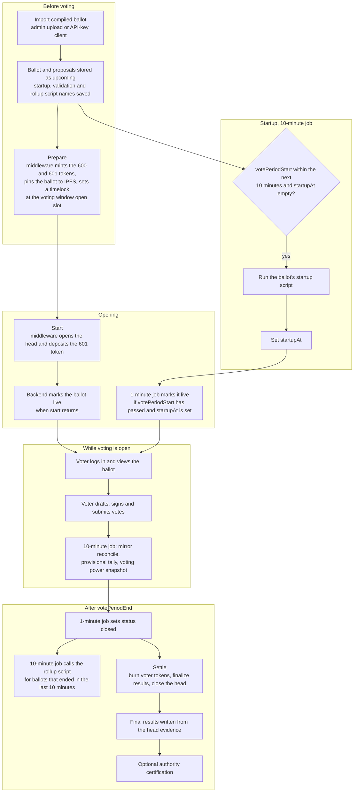
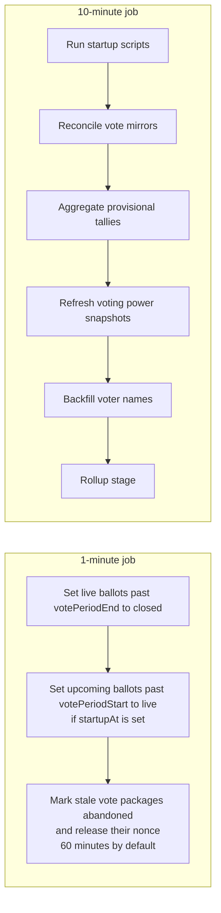
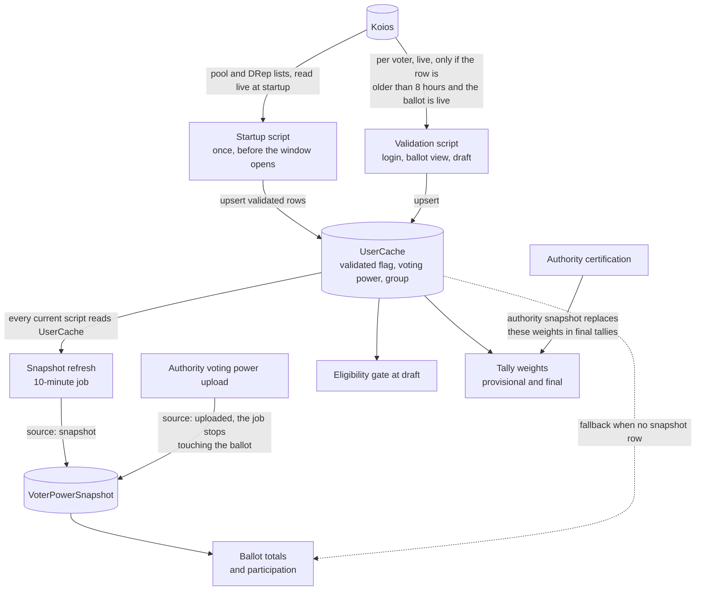
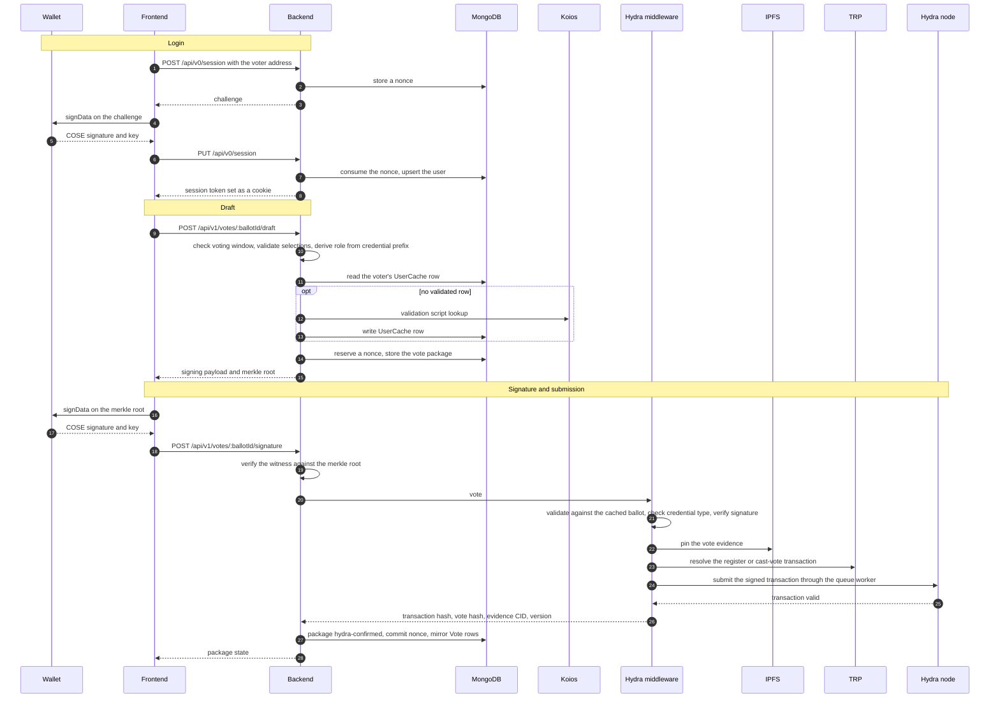
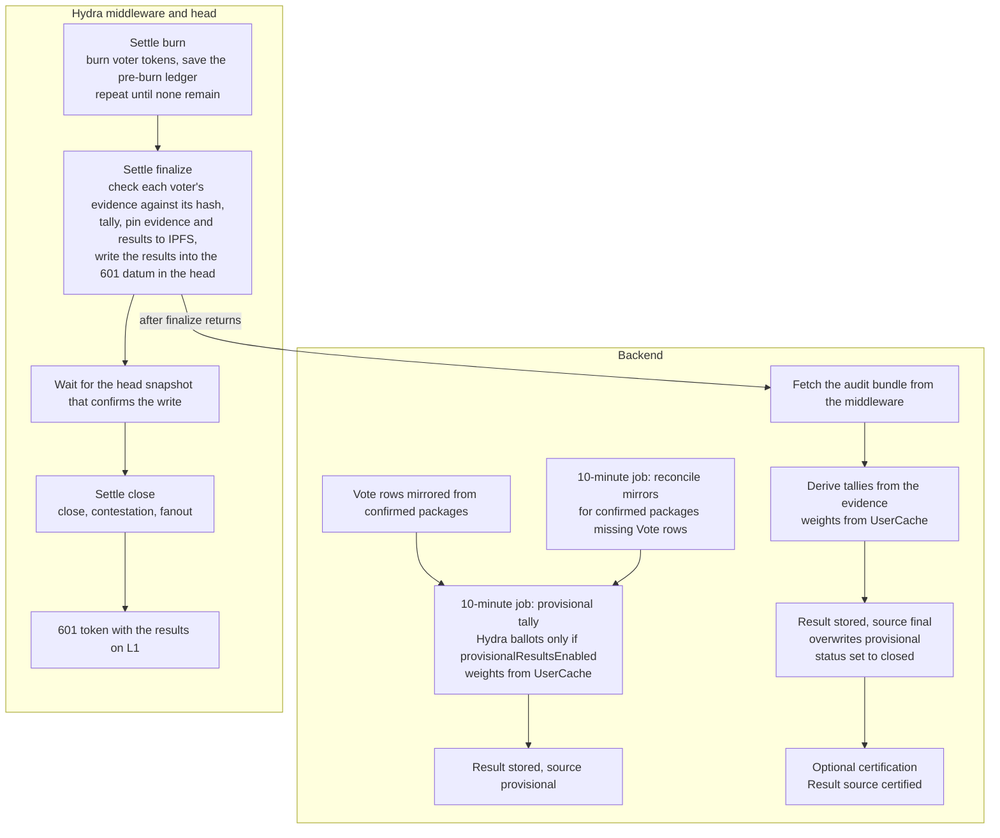

These diagrams describe what the Ekklesia code does today. They cover the
services and how they call each other, the ballot lifecycle including the
backend startup scripts, the places where snapshot data and live chain data are
used, and the path of a single vote from a wallet to the Hydra head and on to
the results.

Request and response payloads are not described here. For what the backend sends
to the Hydra middleware at each stage, see [Hydra &
Architecture]({{ '/hydra/' | relative_url }}).

## Components

The voting site is a static SvelteKit app that the backend serves. The backend
is the only service the browser talks to for voting. It keeps its state in
MongoDB, looks up voter eligibility and voting power on Koios, and drives the
Hydra middleware over HTTP. The middleware owns the Hydra head and everything
that touches it.

Solid lines are calls made on every ballot. Dotted lines are conditional or
informational: the backend serves the built frontend files, the frontend only
links to the proposal module, and the Blockfrost fallback applies only to stake
account lookups when Koios fails with a network error, a 5xx, or a 429 and a
Blockfrost project is configured.

Two libraries are shared across the services:

| Library                        | Used by                                    | For                                                                                                                         |
| ------------------------------ | ------------------------------------------ | --------------------------------------------------------------------------------------------------------------------------- |
| `@lerna-labs/ekklesia-helpers` | Backend, Hydra middleware, proposal module | Server bootstrap and canonical JSON (backend), canonical JSON (middleware), validation and deposit checks (proposal module) |
| `@lerna-labs/hydra-sdk`        | Hydra middleware                           | Hydra node HTTP and WebSocket client, IPFS client, disk cache, signature verification, native scripts                       |

## Ballot status

A ballot has three user-facing statuses. Voting writes are gated on the ballot's
voting window rather than on the status, so a ballot that has not yet been
flipped to `closed` still refuses votes after its end time.

Importing a ballot again is refused once its status is `live` or `closed`.

## Ballot lifecycle

The lifecycle runs on three drivers: the voting authority calling lifecycle
operations through the backend, the two scheduled jobs, and the voters.

Rules the code enforces:

- Prepare mints under a timelocked policy that expires at the slot where the
  voting window opens, so it has to run before the window opens.
- The startup job only considers ballots whose voting period starts within the
  next ten minutes and whose `startupAt` is empty. A ballot whose startup script
  does not return `true` keeps `startupAt` empty. A Koios error inside any of
  the Koios-backed startup scripts ends the whole job run.
- Start and the startup script are independent. Start flips the status to `live`
  on its own. Without it, the 1-minute job flips the status once the voting
  period has begun and `startupAt` is set.
- Start returns before the 601 deposit finishes. The middleware answers vote
  requests with a conflict until its health report shows the ballot active.
- The 10-minute job calls the rollup script for ballots that ended in the last
  ten minutes and have no `resultTxHash`. The code marks this stage as not yet
  live.
- Settle is a stepped sequence: burn until nothing remains, finalize, then
  close. Finalize flips the status to `closed` and writes the final results.
- Certification is an optional authority step that re-weights the final tallies
  from an authority-supplied snapshot.

### What the scheduled jobs do

## Where voting power comes from

This is where snapshot data and live chain data meet. Three things matter: when
the chain is read, where the result is stored, and which stored copy each
consumer reads.

Each ballot names its scripts. A ballot has a startup script, a voter validation
script and a rollup script, and each is a file in the backend's `config`
directory. The defaults are `startupBallot.js`, `voterValidationAlwaysTrue.js`
and `rollupBallot.js`.

### Startup scripts

A startup script runs once, in the 10-minute job, for ballots that start within
the next ten minutes. The data it reads from Koios is live at that moment and is
written to the `UserCache` collection, which makes it a point-in-time copy for
the rest of the ballot.

| Script                        | Reads                                                    | Writes to `UserCache`                                                                                                                    |
| ----------------------------- | -------------------------------------------------------- | ---------------------------------------------------------------------------------------------------------------------------------------- |
| `startupBallot.js`            | Nothing. It logs and returns `true`.                     | Nothing                                                                                                                                  |
| `startupPledgeBasedVoting.js` | Koios pool list and pool info                            | One validated row per pool whose live pledge is at least its pledge, power is live pledge                                                |
| `startupStakeBasedVoting.js`  | Koios pool list and pool info                            | One validated row per pool, power is active stake                                                                                        |
| `startupIncentiveVote.js`     | Koios pool list and pool info, and every registered DRep | Pools whose live pledge is at least their pledge, power is live pledge, group `pool`; every DRep, power is the DRep amount, group `drep` |

### Voter validation scripts

A validation script decides whether a voter is eligible and what their power is.
The first group below reads only what is already in `UserCache`. The second
group reads live chain data for a single voter when the cached row is missing or
older than 8 hours, and only while the ballot status is `live`. Otherwise they
return the cached answer, or reject the voter when there is none.

| Script                               | Source                                                                                                                              | Voting power                                                                    |
| ------------------------------------ | ----------------------------------------------------------------------------------------------------------------------------------- | ------------------------------------------------------------------------------- |
| `voterValidationAlwaysTrue.js`       | `UserCache`, no chain data. Validates any voter on first call.                                                                      | Whatever `UserCache` holds                                                      |
| `voterValidationSnapshot.js`         | `UserCache`, a validated row must exist                                                                                             | Whatever `UserCache` holds                                                      |
| `voterValidationStake.js`            | Re-exports `voterValidationSnapshot.js`                                                                                             | Whatever `UserCache` holds                                                      |
| `voterValidationAlwaysFalse.js`      | None. Rejects every voter.                                                                                                          | None                                                                            |
| `voterValidationDReps.js`            | Koios DRep info, live                                                                                                               | DRep amount                                                                     |
| `voterValidationPoolsPledge.js`      | Koios pool info, live                                                                                                               | Live pledge, if it is at least the pledge                                       |
| `voterValidationPoolsStake.js`       | Koios pool info, live                                                                                                               | Active stake                                                                    |
| `voterValidationPoolsVotingPower.js` | Koios pool info, live                                                                                                               | Pool voting power                                                               |
| `voterValidationStakeholder.js`      | Koios account info, Blockfrost fallback, live                                                                                       | Total account balance. Eligibility also applies the ballot's stake requirements |
| `voterValidationByCredential.js`     | Routes by voter credential prefix to the DRep, pool pledge or stakeholder script, after checking the ballot's declared voter groups | As the script it routes to                                                      |

What this means in practice:

- A ballot that pairs a startup script with a live validation script, such as
  `startupPledgeBasedVoting.js` with `voterValidationPoolsPledge.js`, starts
  from the startup copy of voting power. Each voter's row is replaced with a
  live lookup the next time their row is older than 8 hours and a validation
  call reaches the script. At draft time, a voter with a cached row already
  marked validated is accepted without a refresh, and the script is called only
  when the row is missing or not validated.
- A ballot with `startupBallot.js` and a live validation script, such as
  `voterValidationDReps.js`, has no startup copy at all. Every voter's power is
  looked up on demand and cached.
- Tally weights, in both the provisional and the final tally, come from
  `UserCache`. A voter with no `UserCache` row is weighted as 1 in both.
- Ballot totals and participation come from `VoterPowerSnapshot` first and fall
  back to `UserCache`. Each snapshot refresh runs the ballot's script
  `computePerVoterPower`, which in every current script reads the validated
  `UserCache` rows, so the refresh copies `UserCache` into `VoterPowerSnapshot`.
  An authority upload writes `VoterPowerSnapshot` directly and the refresh then
  skips the ballot.
- The ballot's `votingPowerSource` is `snapshot` by default. When no snapshot
  rows exist yet, the totals are computed once from the script, which reads
  `UserCache`. With `uploaded`, the script is never called for totals.

## Vote path

A vote goes from the wallet to the frontend, then to the backend, which holds a
draft and collects the signature, and then to the Hydra middleware, which
validates, pins and submits it to the head. Login comes first.

Multisig voters collect several witnesses first. The backend submits to the
middleware only when the native script threshold is met, and until then it
answers each signature request with the collected state. The backend also offers
a submit call to retry a package that is waiting for submission.

Voting power is not part of the vote. The head records signed vote evidence, and
the backend applies voting power to it when tallying.

## Tally and settlement

Provisional tallies come from the backend's own copy of the votes. Final tallies
come from the head's evidence after settlement.

Final results overwrite provisional results, and a proposal that already has a
`final` or `certified` result is skipped by the provisional tally. If the
finalize response is lost, a recover call fetches the stored response from the
middleware and writes the same results.
